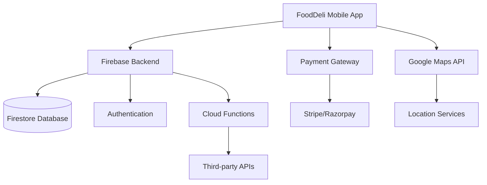

# Architecture

This document describes the architecture of the FoodDeli food delivery application.

## Overview

FoodDeli is a Flutter-based mobile application that connects customers with local restaurants for food delivery services. The application follows a client-server architecture with Firebase as the primary backend service.

## System Architecture



## Frontend Architecture

### Technology Stack
- **Framework**: Flutter (Dart)
- **State Management**: GetX
- **UI Components**: Custom widgets with Material Design
- **Navigation**: GetX routing

### Module Structure
```
lib/
├── app/
│   ├── data/
│   │   ├── api/
│   │   ├── model/
│   │   └── repository/
│   ├── modules/
│   │   ├── auth/
│   │   ├── dashboard/
│   │   ├── home/
│   │   ├── profile/
│   │   └── splash/
│   ├── routes/
│   └── utils/
├── helper/
└── widgets/
```

### Key Components
1. **Authentication Module**: User registration and login
2. **Dashboard Module**: Main application interface
3. **Home Module**: Order management and tracking
4. **Profile Module**: User settings and preferences
5. **Splash Module**: Initial loading screen

## Backend Architecture

### Firebase Services
- **Firestore**: Primary database for storing user, restaurant, and order data
- **Authentication**: User authentication and management
- **Cloud Functions**: Serverless functions for business logic
- **Cloud Messaging**: Push notifications for order updates
- **Storage**: Image storage for profile pictures and restaurant logos

### Third-party Integrations
- **Google Maps**: Location services and route optimization
- **Payment Gateways**: Stripe/Razorpay for payment processing
- **SMS Services**: Twilio for SMS notifications
- **Email Services**: SendGrid for email notifications

## Data Flow

1. **User Authentication**: Users authenticate through Firebase Auth
2. **Data Retrieval**: App fetches data from Firestore
3. **Order Processing**: Orders are processed through Cloud Functions
4. **Payment Handling**: Payments are processed through third-party gateways
5. **Notification**: Real-time updates via Firebase Cloud Messaging

## Security Architecture

### Data Protection
- End-to-end encryption for sensitive data
- Secure token-based authentication
- Role-based access control
- Regular security audits

### Compliance
- GDPR compliance for EU users
- PCI DSS compliance for payment processing
- Regular penetration testing

## Scalability Considerations

### Horizontal Scaling
- Firebase automatically scales with demand
- Microservices architecture for independent scaling
- Load balancing through Firebase infrastructure

### Performance Optimization
- Caching strategies for frequently accessed data
- Image optimization and compression
- Lazy loading for improved performance
- Background processing for non-critical tasks

## Deployment Architecture

### CI/CD Pipeline
- GitHub Actions for automated testing
- Codemagic for Flutter builds
- Automated deployment to app stores

### Environment Management
- Development, staging, and production environments
- Environment-specific configuration files
- Feature flags for gradual rollouts

## Monitoring and Analytics

### Logging
- Centralized logging through Firebase
- Error tracking with detailed stack traces
- Performance monitoring

### Analytics
- User behavior tracking
- Conversion funnel analysis
- Performance metrics monitoring

## Future Architecture Improvements

### Planned Enhancements
- Migration to microservices architecture
- Implementation of GraphQL for flexible data querying
- Enhanced caching mechanisms
- Improved offline capabilities

This architecture document will be updated as the system evolves and new requirements are identified.